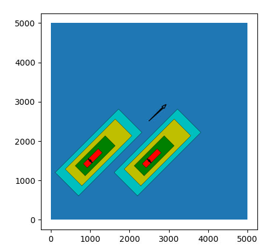
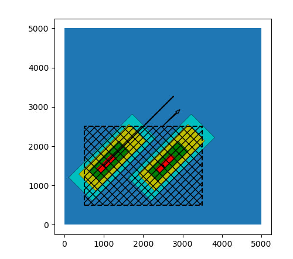
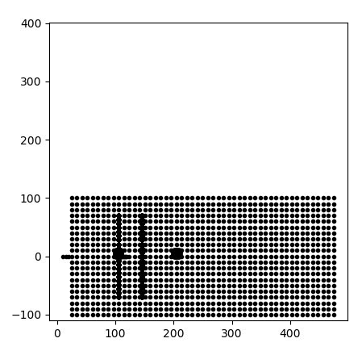
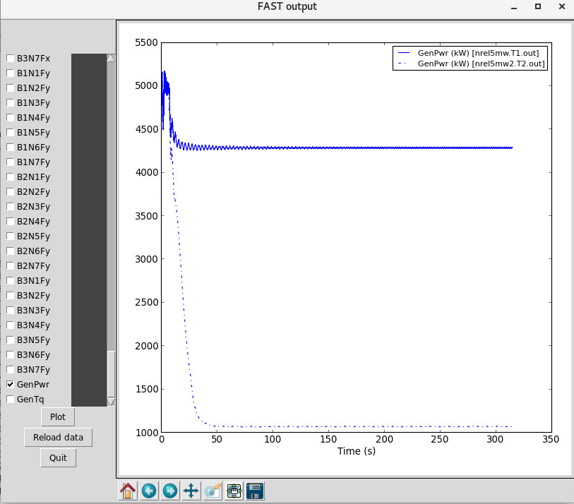
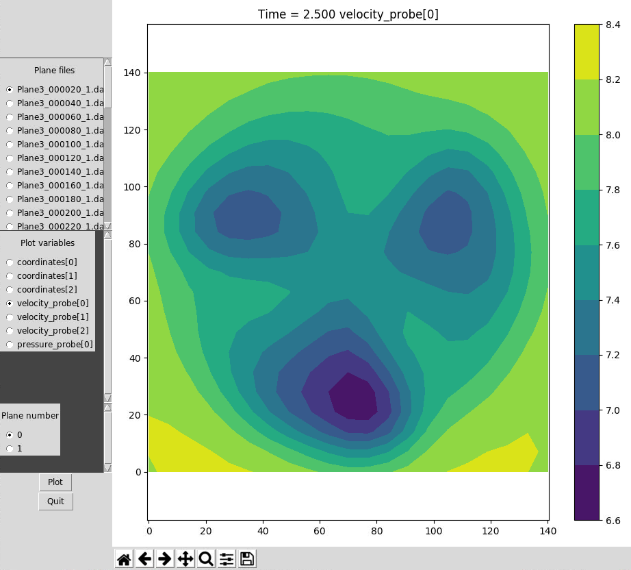

# Nalu-Wind Helper Scripts

Scripts to help with Nalu-Wind

**Contents**
- [Plot mesh script](#plot-mesh-refinement): [plotmesh.py](plotmesh.py)
- [Mesh refinement script](#mesh-refinement-script): [buildrefinemesh.sh](buildrefinemesh.sh)
- [Slice mesh utility](#slice-mesh-utility): [slicemesh.sh](slicemesh.sh)
- [Plot FAST output script](#plot-fast-output): [plotFAST.py](plotFAST.py)
- [Backup and write a restart YAML file](#backup-and-write-a-restart-yaml-file): [restartbackupnalu.py](restartbackupnalu.py)
- [Plot sample planes](#plot-sample-planes): [plotSamplePlaneGUI.py](plotSamplePlaneGUI.py)
- [Convert sample planes to VTK](#convert-sample-planes-to-vtk): [convertSamplePlane2VTK.py](convertSamplePlane2VTK.py)

## Plot mesh refinement
<details>
  <summary><b>[plotmesh.py](plotmesh.py): Plots the mesh refinement levels, turbine locations, and cut-slices</b> </summary>
  
#### Usage
```bash
$ module load canopy
$ plotmesh.py YAMLFILE
```
Here `YAMLFILE` is a yaml file containing the mesh definition, refinement windows, and (optionally) the slice mesh parameters.

Output:  
  

Each different colored rectangle represents a halving of the mesh resolution (8x refinement).  The arrow in the middle of the domain points in the wind direction.

If you include the `slice_mesh` section in the YAML file, then it will also include the areas where the sections are being taken, like this:  
  

The `plotmesh.py` script will also plot the probes in the `data_probes` section.
If you include the following in your input file
```yaml
  data_probes:
    exodus_name: exoprobe/probes3.exo
    output_frequency: 1
    search_method: stk_kdtree
    search_tolerance: 1.0e-5 #1.0e-3
    search_expansion_factor: 2.0
 
    specifications:
    - name: probe_surface
      from_target_part: Unspecified-2-HEX
      line_of_site_specifications:        
        - name: Probe1 # boostProbes2/probes/Probe1
          number_of_points: 3
          tip_coordinates:  [10, 0, 0]
          tail_coordinates:  [20, 0, 0]
        - name: Probe2 # boostProbes2/probes/Probe2
          number_of_points: 11
          tip_coordinates:  [100, 0, 0]
          tail_coordinates:  [120, 0, 0]
      plane_specifications:        
        - name: boostProbes2/planes/p1/Plane1
          corner_coordinates:  [25, -100, 0]
          edge1_vector:    [450, 0, 0]
          edge2_vector:    [0, 200, 0]
          edge1_numPoints: 51
          edge2_numPoints: 21
          #offset_vector:   [0, 0, 1]
          #offset_spacings: [0, 100]
        - name: ./Plane2 #boostProbes2/planes/p2/Plane2
          edge1_numPoints: 31
          edge2_numPoints: 31
          corner_coordinates:  [100, 0, 0]
          edge1_vector:    [10, 0, 0]
          edge2_vector:    [0, 10, 0]
          offset_vector:   [1, 0, 0]
          offset_spacings: [0, 100]
        - name: boostProbes2/planes/p3/Plane3
          edge1_numPoints: 21
          edge2_numPoints: 21
          corner_coordinates:  [126, -70, -70]
          edge1_vector:    [0, 140, 0]
          edge2_vector:    [0, 0, 140]
          offset_vector:   [1, 0, 0]
          offset_spacings: [-20, 20]
      output_variables:
        - field_name: velocity
          field_size: 3
```
Then the output of `plotmesh.py` will look like:  

  

</details>

## Mesh refinement script
<details>
  <summary><b>[buildrefinemesh.sh](buildrefinemesh.sh): Creates a mesh, does local refinement</b></summary>
  
#### Usage

```
buildrefinemesh.sh YAMLFILE [OPTIONS]

Arguments
  YAMFILE   : a yaml file containing the mesh definitions

Options: 
  -o|--output-mesh OUTFILE  : Output filename (default: refinedmesh.exo)
  -n|--ncores      NPU      : Number of cores to use (default: 8)
  --no-createmesh           : Do not create basic mesh
  --no-preproc              : Do not use the preprocessor to define mesh refinem ent zones
  --no-refine               : Do not use mesh_adapt to refine mesh
  -h|--help                 : This help file

```
The argument `YAMLFILE` should point to a yaml input file like this:  
```yaml
nalu_abl_mesh:
  output_db: mesh_abl.exo
  spec_type: bounding_box
  fluid_part_name: fluid_part

  vertices:
  - [0.0, 0.0, 0.0]
  - [1000.0, 1000.0, 300.0]
  mesh_dimensions: [100, 100, 30]

  xmin_boundary_name: west
  xmax_boundary_name: east
  ymin_boundary_name: south
  ymax_boundary_name: north
  zmin_boundary_name: lower
  zmax_boundary_name: upper

# Mandatory section for Nalu preprocessing
nalu_preprocess:
  # Name of the input exodus database
  input_db: mesh_abl.exo
  # Name of the output exodus database
  output_db: mesh_abl.exo

  # Nalu preprocessor expects a list of tasks to be performed on the mesh and
  # field data structures
  tasks:
    - mesh_local_refinement

  mesh_local_refinement:
    fluid_parts: [fluid_part]
    write_percept_files: true
    percept_file_prefix: adapt
    search_tolerance: 11.0
    turbine_locations:
      - [ 200.0, 200.0, 0.0 ]
      - [ 230.0, 300.0, 0.0 ]
    turbine_diameters: 15.0        # Provide a list for variable diameters
    turbine_heights: 50.0          # Provide a list for variable tower heights
    orientation:
      type: wind_direction
      wind_direction: 225.0
    refinement_levels:             # Numbers are for upstream, downstream, lateral and vertical length in turbine diameters
      - [ 7.0, 12.0, 7.0, 7.0 ]
      - [ 5.0, 10.0, 5.0, 5.0 ]
      - [ 3.0, 6.0, 3.0, 3.0 ]
```

When you execute the script, for instance
```bash
$ ./buildrefinemesh.sh testmesh.yaml -o testmesh.exo
```
the first stage should be the mesh creation part
```
Nalu ABL Mesh Generation Utility
Input file: testmesh.yaml
HexBlockBase: Registering parts to meta data
	Mesh block: fluid_part
Num. nodes = 41616; Num elements = 37500
	Generating nodes...done
	Generating elements...done
	Creating element connectivity... done
	Generating X Sideset: west
	Generating X Sideset: east
	Generating Y Sideset: south
	Generating Y Sideset: north
	Generating Z Sideset: lower
	Generating Z Sideset: upper
	Finalizing bulk data modifications ... done
	Generating coordinates...
	 Generating x spacing: constant_spacing
	 Generating y spacing: constant_spacing
	 Generating z spacing: constant_spacing
Writing mesh to file: mesh_abl.exo
```
Followed by the preprocessing stage which marks out areas for local refinement:
```
Nalu Preprocessing Utility
Input file: testmesh.yaml
Found 1 tasks
    - mesh_local_refinement

Performing metadata updates... 
Metadata update completed
Reading mesh bulk data... done.

--------------------------------------------------
Begin task: mesh_local_refinement
```
Then it will run mesh_adapt through the multiple stages of refinement:
```
Running mesh refinement step
------------------
STAGE 1 REFINEMENT: tempmesh0.e --> tempmesh1.e
------------------
mpirun -n 8 mesh_adapt --refine=DEFAULT --input_mesh=tempmesh0.e --output_mesh=tempmesh1.e --RAR_info=adapt1.yaml --ioss_read_options="auto-decomp:yes" 
INFO: ioss_read_options=auto-decomp:yes ioss_write_options=
PerceptMesh:: opening tempmesh0.e

Using decomposition method 'RIB' on 8 processors.
```

At the very end, it will copy over the final mesh and report the new mesh blocks which are included:
```
‘tempmesh2.e’ -> ‘testmesh.exo’

New mesh blocks: 
 eb_names =
  "fluid_part",
  "fluid_part.pyramid_5._urpconv",
  "fluid_part.tetrahedron_4._urpconv",
  "fluid_part.pyramid_5._urpconv.Tetrahedron_4._urpconv" ;
}
```
</details>


## Slice mesh utility
<details>
  <summary><b>[slicemesh.sh](slicemesh.sh): Creates the slice geometry for a mesh</b></summary>
  
#### Usage
```bash
./slicemesh.sh MESHYAMLFILE [OPTIONS]
```
where MESHYAMLFILE is the yaml file containing the slice mesh parameters.

Optional Arguments:
```bash
  -y|--yaml-output YAMLFILE    Print out the corresponding yaml inputs needed to include the slice mesh 
                               output during the simulation.  YAMLFILE is the main simulation yamlfile
  -v|--extra-vars  VARLIST     An extra list of variables to include when writing out the sliced meshes.
                               VARLIST is of the form "var1:N var2:N ..." where var1, var2, are the
                               variable names, and N is the number of components for that variable
```

The MESHYAMLFILE input file defining the slices to take:
```yaml
slice_mesh:
  output_db: temp.exo # sliceplanes.exo

  slices:
    # X-Y plane
    - axis1: [1.0, 0.0, 0.0]
      axis2: [0.0, 1.0, 0.0]
      axis3: [0.0, 0.0, 1.0]
      origin: [0.0, 0.0, 0.0]
      grid_lengths: [2500.0, 2500.0]
      grid_dx: [4.0, 4.0]
      num_planes: 1
      plane_offsets: [0.0]
      part_name_prefix: turbineHH

    # Y-Z plane 
    - axis1: [1.0, 1.0, 0.0]
      axis2: [0.0, 0.0, 1.0]
      axis3: [-1,  1.0, 0.0]
      origin: [0.0, 00, -100.0]
      grid_lengths: [3000.0, 200.0]
      grid_dx: [4.0, 4.0]
      num_planes: 1
      plane_offsets: [0.0]
      part_name_prefix: turbineSlice2

```

If you execute it with the input files:
```bash
$ slicemesh.sh mesh1.yaml 
yamlfile    = mesh1.yaml
simyamlfile = 
extravars   = 
Loading modules
Output mesh name = temp.exo
Slice Mesh Generation Utility
Input file: mesh1.yaml
Loading slice inputs... 
Initializing slices... 
Slice: Registering parts to meta data: 
  -  turbineHH_1
Slice: Registering parts to meta data: 
  -  turbineSlice2_1
Generating slices for: turbineHH
Creating nodes... 10% 20% 30% 40% 50% 60% 70% 80% 90% 100% 
Creating elements... 10% 20% 30% 40% 50% 60% 70% 80% 90% 100% 
Generating coordinate field
 - turbineHH_1
Generating slices for: turbineSlice2
Creating nodes... 10% 20% 30% 40% 50% 60% 70% 80% 90% 100% 
Creating elements... 10% 20% 30% 40% 50% 60% 70% 80% 90% 100% 
Generating coordinate field
 - turbineSlice2_1
Writing mesh to file: temp.exo

Memory usage: Avg:  156.043 MB; Min:  156.043 MB; Max:  156.043 MB
```

If you execute it with the `-y` option, like `slicemesh.sh
mesh1test.yaml -y alm_simulation.yaml`, then some additional output will be generated:
```bash
# === Auto-generated YAML below ======

# Goes under [realms:]
- name: ioRealm
  mesh: temp.exo
  type: input_output
  automatic_decomposition_type: rcb

  field_registration:
    specifications:
    - field_name: velocity_slice
      target_name: &fieldreg [ turbineHH_1, turbineSlice2_1 ]
      field_size: 3
      field_type: node_rank
  output:
    output_data_base_name: ./sliceDataInstantaneous/temp.exo
    output_frequency: 1
    output_node_set: no
    output_variables:
    - velocity_slice
transfers:
- name: turbineHH_1
  type: geometric
  realm_pair: [realm_1, ioRealm]
  to_target_name: turbineHH_1
  from_target_name: ['fluid_part', 'fluid_part.Pyramid_5._urpconv', 'fluid_part.Tetrahedron_4._urpconv']
  objective: input_output
  transfer_variables:
  - [velocity, velocity_slice]
- name: turbineSlice2_1
  type: geometric
  realm_pair: [realm_1, ioRealm]
  to_target_name: turbineSlice2_1
  from_target_name: ['fluid_part', 'fluid_part.Pyramid_5._urpconv', 'fluid_part.Tetrahedron_4._urpconv']
  objective: input_output
  transfer_variables:
  - [velocity, velocity_slice]

# === End auto-generated YAML ======
```

These yaml parameters can be added to `alm_simulation.yaml` to extract
the slice during simulations.
</details>


## Plot FAST output
<details>
  <summary><b>[plotFAST.py](plotFAST.py): Plots FAST output</b></summary>
  
#### Usage  
```bash
$ module load canopy
$ plotFAST.py FAST.T1.out [FAST.T2.out  ... ]
```
Output:  
  

It's pretty self-explanatory.  Check the variables on the left you would like to plot, and hit `Plot`.
If the output files get updated, hit `Reload data` to reread the files from disk.
</details>


## Backup and write a restart YAML file
<details>
  <summary><b>[restartbackupnalu.py](restartbackupnalu.py): Retarts and backups up a simulation from a YAML file</b></summary>

This script takes in the current YAML input file, then automatically
sets up the right restart parameters and spits out a new YAML file.
Works on both ABL and FAST turbine runs.  Optionally backups all the
restart/output files so they don't get overwritten.

#### Usage
```
usage: restartbackupnalu.py [-h] [--dobackup] [--Nsteps NSTEPS]
                            [--suffix SUFFIX]
                            yamlfile [yamlfile ...]

Create a restart YAML file for Nalu.

positional arguments:
  yamlfile

optional arguments:
  -h, --help            show this help message and exit
  --dobackup            Backup files [default=False]
  --addNsteps ADDNSTEPS
                        Add another ADDNSTEPS to the run [default 100]
  --runToNsteps RUNTONSTEPS
                        Run until RUNTONSTEPS are reached [default is
                        ADDNSTEPS, not RUNTONSTEPS]
  --suffix SUFFIX       Suffix to attach to backup files [default is date/time
                        based suffix]

```
</details>

## Plot sample planes
<details>
  <summary><b>[plotSamplePlaneGUI.py](plotSamplePlaneGUI.py): GUI to plot the sample planes</b></summary>
  
#### Usage
```
usage: plotSamplePlaneGUI.py [-h] [--nogui] [--planenum PLANENUM]
                             [--varnum VARNUM]
                             [PLANEFILE [PLANEFILE ...]]

Plot sample mesh

positional arguments:
  PLANEFILE            Plot this sample plane

optional arguments:
  -h, --help           show this help message and exit
  --nogui              Use command line only [default=False]
  --planenum PLANENUM  Plot this plane number
  --varnum VARNUM      Plot this variable number
```

For example, let's say you created a set of planes with the following
specifications:
```yaml
   specifications:
    - name: probe_surface
      from_target_part: Unspecified-2-HEX
      plane_specifications:
        - name: Probes/Plane3
          edge1_numPoints: 21
          edge2_numPoints: 21
          corner_coordinates:  [126, -70, -70]
          edge1_vector:    [0, 140, 0]
          edge2_vector:    [0, 0, 140]
          offset_vector:   [1, 0, 0]
          offset_spacings: [-20, 20]
      output_variables:
        - field_name: velocity
          field_size: 3
```

These planes can be plotted by loading them in `plotSamplePlaneGUI.py`:
```bash
$ plotSamplePlaneGUI.py Plane3*_1.dat
```

On the left hand side there are the different plane files, plot
variables, and plane numbers in each file.  Select the parameters to
display, and hit the `Plot` button to see something like:  

  

</details>

## Convert sample planes to VTK
<details>
  <summary><b>[convertSamplePlane2VTK.py](convertSamplePlane2VTK.py): This script converts the text output sample planes to ASCII VTK format.</b></summary>

#### Usage
```bash
usage: convertSamplePlane2VTK.py [-h] [--planenum PLANENUM]
                                 PLANEFILE [PLANEFILE ...]

Convert sample planes to ASCII VTK format

positional arguments:
  PLANEFILE            Sample plane file(s) to convert

optional arguments:
  -h, --help           show this help message and exit
  --planenum PLANENUM  Convert only this offset plane number [default: convert
                       all planes]
```

#### Example
```bash
$ convertSamplePlane2VTK.py --planenum 0 HHplane_0009[0-3]*.dat
Converting HHplane_0009000_0.dat
 -> writing HHplane_0009000_0_plane0.vtk
Converting HHplane_0009100_0.dat
 -> writing HHplane_0009100_0_plane0.vtk
Converting HHplane_0009200_0.dat
 -> writing HHplane_0009200_0_plane0.vtk
Converting HHplane_0009300_0.dat
 -> writing HHplane_0009300_0_plane0.vtk
```
</details>