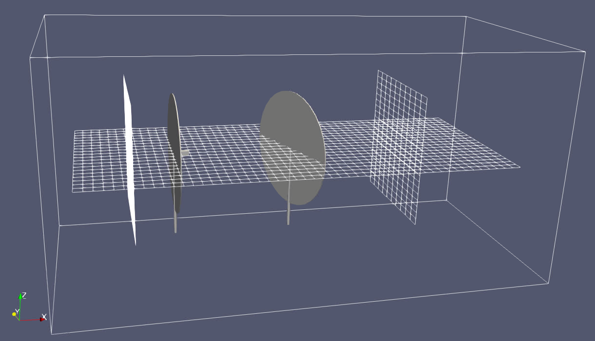
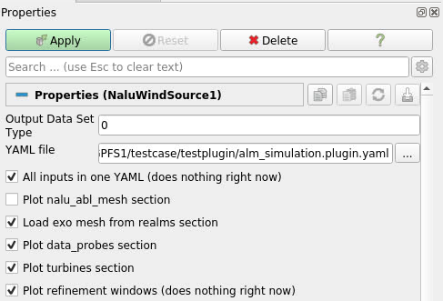
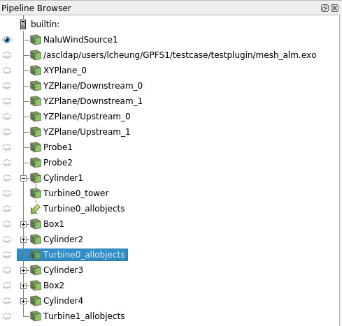
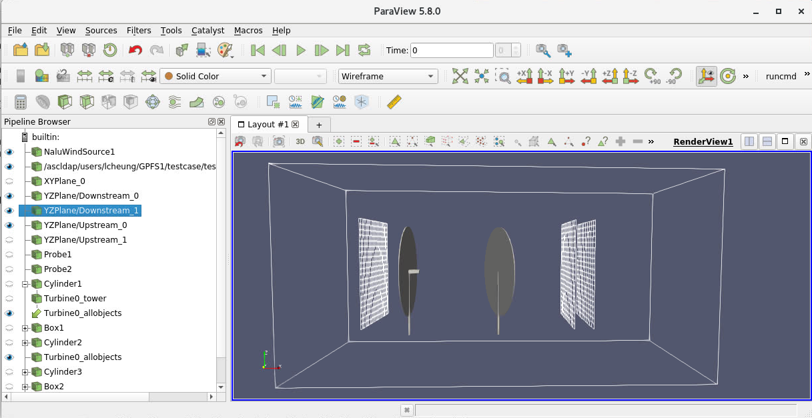

# Nalu-Wind plugin for Paraview

A Paraview plugin to visualize the setup and domain of your Nalu-Wind
simulation.



With this plugin, you can load your Nalu-Wind input file, FAST setup
files, and have paraview plot all of the objects in the domain,
including:
 - The domain mesh
 - Sample planes
 - The turbine placements, sizes, and yaw

Yes, I know the turbines look like lollipops right now, but that is to
be fixed later.

## Installation

### What you need
- [Paraview](https://www.paraview.org/) (obviously).  Plug in tested
  on version 5.8 on linux and windows.
- The [plugin xml](naluwindplugin.xml) file
- A working python installation that can load the `pyyaml` package. 
  If you don't have one, you can get it from [WinPython](https://winpython.github.io/)

### Steps
1.  Download the [naluwindplugin.xml](naluwindplugin.xml) xml file to
    a convenient location.

2.  Start paraview.

3.  Go to `Tools -> Manage Plugins...`

4.  Under `Local Plugins`, click `Load New...`

5.  Navigate to where you downloaded the plugin, select the xml file,
    and hit `OK.`
	
	If all goes well, you should see the `naluwindplugin` and `Loaded`
    status under the list of plugins.

**Note**: You have to manually reload the plugin every time you start
Paraview.  It doesn't get automatically loaded.

## Usage
### Loading the input file
1.  Go to the `Sources` menu, then look for `Nalu Wind Source` under
    the `Alphabetical` category.

2.  In the properties tab, select the right input file in the `YAML
    file` input.



3.  In the checklist, check which items you wish to plot.

| Item                              | Description                                          |
| ---                               | ---                                                  |
| All inputs in one YAML            | Ignore for now.  This does nothing                   |
| Plot nalu_abl_mesh section        | Plot the mesh created in the `nalu_abl_mesh` section |
| Load exo mesh from realms section | Loads the `exo` meshes in the input file.  Note: this could take a long time for large meshes. |
| Plot data_probes section          | Plots the sample planes and data probes              |
| Plot turbines section             | Plots the actuator turbines                          |
| Plot refinement windows           | Ignore for now.  This does nothing                   |


4.  In the `Python executable` input, choose the location of the python 
    executable.  For linux, the default 'python' should be acceptable most
    of the time.

5.  Hit `Apply` button.  After the input file gets loaded, it should
    create a number of objecs in the pipeline browser:  
	

	
### Created objects

- **Sample planes** are created with the same name as in the input
  file.  You can turn on the `Wireframe` view to see the *exact* grid
  resolution that will be sampled.
- **Turbines** are created using a number of boxes and cylinders.
  Turn on the `TurbineX_allobjects` object to visual the entire group
  of objects belonging to that turbine.
- The **.exo mesh file** will be loaded with the same file name.  You
  can view this in `Outline` form to see all of the objects inside of
  it.

A sample of what should be displayed is here:  




## Developer notes

The plugin is written in Python, and is then inserted into an xml file
which Paraview can use as a plugin..

If you want to change the code, edit the
[embedpython.py](embedpython.py) file, then run the `createpvxml.sh`
script to generate the xml:

```bash
$ vi embedpython.py
$ ./createpvxml.sh
```
