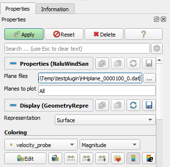

# Nalu-Wind plugin for Paraview

A Paraview plugin to visualize your Nalu-Wind domain and sample plane
outputs.


With this plugin, you can:
* Load your Nalu-Wind input file, FAST setup files, and have paraview
plot all of the objects in the domain, including:
  - The domain mesh
  - Sample plane geometry
  - The turbine placements, sizes, and yaw
  - Currently **does not** work in client/server mode
* Load your sample planes 
  - Both uncompressed (.dat) and compressed form (.dat.gz)
  - Works in client/server mode

Yes, I know the turbines look like lollipops right now, but that is to
be fixed later.

## Contents
* [Installation](#installation)
  - [What you need](#what-you-need)
  - [Steps](#steps)
* [Using Nalu Input File Plugin](#using-nalu-input-file-plugin)
* [Using Sample Plane Plugin](#using-sample-plane-plugin)
* [Developer notes](#developer-notes)

## Installation

### What you need
- [Paraview](https://www.paraview.org/) (obviously).  Plug in tested
  on version 5.8 on linux and windows.
- The [plugin xml](naluwindplugin.xml) file
- A working python installation that can load the `pyyaml` package.
  This is needed for the input file plugin (because `pvpython` doesn't
  include the package).  If you don't have an external python install,
  you can get it from the [python
  website](https://www.python.org/downloads/) or
  [WinPython](https://winpython.github.io/)

### Steps
1.  Download the [naluwindplugin.xml](naluwindplugin.xml) xml file to
    a convenient location.

2.  Start paraview.

3.  Go to `Tools -> Manage Plugins...`

4.  Under `Local Plugins`, click `Load New...`

5.  Navigate to where you downloaded the plugin, select the xml file,
    and hit `OK.`
	
	If all goes well, you should see the `naluwindplugin` and `Loaded`
    status under the list of plugins.

6.  If you're running Paraview in client/server mode, make sure to
    load the plugin under the left hand `Remote Plugins` side too.
    Both the local and remote should have the sample plugin loaded to
    work in this instance.

**Note**: If you want to automatically reload the plugin everything
you start Paraview, click on the triangle to expand the plugin, and
then check "Auto Load".  Otherwise you will need to manually reload
the plugin.  


## Using Nalu Input File Plugin
### Loading the input file
1.  Go to the `Sources` menu, then look for `Nalu Wind Input File` under
    the `Alphabetical` category.

2.  In the properties tab, select the right input file in the `YAML
    file` input.


**Note**: All of the assocated files, like the mesh `.exo`, turbine
	`.fst`, and FAST files should be in the expected location where
	the input file can find them. If you copied over the input file
	from somewhere else, don't forget to copy over those other files
	if you want the plugin to display those objects.
	

3.  In the checklist, check which items you wish to plot.

| Item                              | Description                                          |
| ---                               | ---                                                  |
| All inputs in one YAML            | Ignore for now.  This does nothing                   |
| Plot nalu_abl_mesh section        | Plot the mesh created in the `nalu_abl_mesh` section |
| Load exo mesh from realms section | Loads the `exo` meshes in the input file.  Note: this could take a long time for large meshes. |
| Plot data_probes section          | Plots the sample planes and data probes              |
| Plot turbines section             | Plots the actuator turbines                          |
| Plot refinement windows           | Ignore for now.  This does nothing                   |


4.  In the `Python executable` input, choose the location of the python 
    executable.  For linux, the default 'python' should be acceptable most
    of the time.

5.  Hit `Apply` button.  After the input file gets loaded, it should
    create a number of objecs in the pipeline browser:  
	

	
### Created objects

- **Sample planes** are created with the same name as in the input
  file.  You can turn on the `Wireframe` view to see the *exact* grid
  resolution that will be sampled.
- **Turbines** are created using a number of boxes and cylinders.
  Turn on the `TurbineX_allobjects` object to visual the entire group
  of objects belonging to that turbine.
- The **.exo mesh file** will be loaded with the same file name.  You
  can view this in `Outline` form to see all of the objects inside of
  it.

A sample of what should be displayed is here:  


## Using Sample Plane Plugin
1.  Go to the `Sources` menu, then look for `Nalu Wind Sampleplane` under
    the `Alphabetical` category.

2.  In the properties tab, choose the sample plane file in the `Plane
    files` input:
	
	

	**Note**: the selection box usually only lets you choose one file,
    but you can load multiple files by using a regular expression.
    For instance, you can put in `HHplane_*_0.dat` or
    `HHplane_00[0-3]*.dat`.
	
3.  In the `Planes to plot` box, put in the planes you want to plot in
    Paraview.  You can put in `All` to just plot all planes, or a
    comma/space delimited list like `0, 1, 5 6` to plot only those
    planes.
	
4.  Hit the `Apply` button to load the sample planes.  If you load
    more than one sample plane (corresponding to different times),
    you'll see that the different times and iterations available in
    the `Time` toolbar.
	
**Note**: You can load both the plain text (`*.dat`) and gzip
compressed (`*.dat.gz`) sample planes.  The plugin will decompress as
needed.

## Developer notes

The plugin is written in Python, and is then inserted into an xml file
which Paraview can use as a plugin.

If you want to change the code, edit the python files
- [embedpython.py](embedpython.py)
- [embedPlotPlane.py](embedPlotPlane.py)
- [embedRequestInfoTempsteps.py](embedRequestInfoTempsteps.py)  

then run the `createplugin.sh` to generate the xml:

```bash
$ vi embedpython.py
$ ./createpvxml.sh
```
